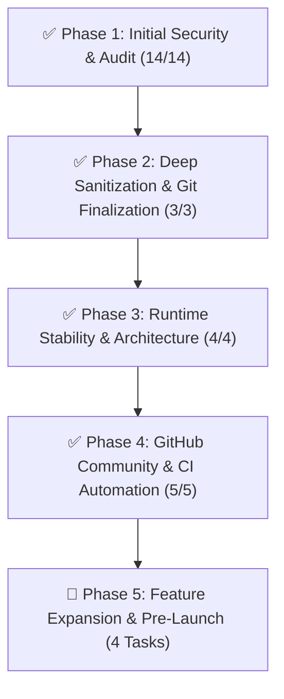

# 🚀 Capybara Bot — Master Production & Open-Source Readiness Checklist

This master checklist tracks all security, privacy, reliability, infrastructure, and feature milestones for the **Capybara Discord Bot** before and after publishing the repository to GitHub.

---

## 📌 Master Checklist Overview

| Phase | Category | Focus | Items | Status |
| :---: | :--- | :--- | :---: | :---: |
| **Phase 1** | Initial Audit & Compliance | Credentials, Licenses, Dynamic Invite, Emoji Fallbacks | 14 Tasks | **100% Completed** ✅ |
| **Phase 2** | Deep Sanitization & Git Finalization | Wispbyte Docs, Tree Commit, Git History Purge | 3 Tasks | **100% Completed** ✅ |
| **Phase 3** | Runtime Reliability & Code | 3s Deferral Fix, Graceful Shutdown, Author-Only Buttons, Unit Tests | 4 Tasks | **100% Completed** ✅ |
| **Phase 4** | GitHub Community & CI | GitHub Actions, Issue Templates, PR Template, Dependabot, Badges | 5 Tasks | **100% Completed** ✅ |
| **Phase 5** | Feature Expansion & Pre-Launch | Token Reset, `/coming-soon`, Localization (i18n), Modular Refactor | 4 Tasks | **Next Up / Remaining** 🌟 |

---

## ✅ Phase 1: Completed Security & Initial Audit Items

- [x] **1. Clean or Remove `capy-discord-bot.zip`** — Deleted zip archive containing unencrypted `.env` token.
- [x] **2. Remove `test/run.lnk` from Git Tracking** — Removed binary Windows shortcut leaking user and computer metadata.
- [x] **3. Sanitize Server UUID in `WISPBYTE.md`** — Redacted private Wispbyte container UUID from documentation.
- [x] **4. Configure Git Commit Email Privacy** — Set local git email to GitHub no-reply address (`203899428+mikroskato62@users.noreply.github.com`).
- [x] **5. Fix Broken `npm test` Script in `package.json`** — Created automated test suite in [`tests/bot-test.js`](file:///c:/Users/User/Desktop/discord-bot/tests/bot-test.js).
- [x] **6. Add Fallback for Custom Emoji in Reactions and Buttons** — Graceful fallback to `🦫` if custom emoji ID is absent or inaccessible.
- [x] **7. Make Bot Invite Link Dynamic in `index.js`** — Uses `${client.user.id}` instead of hardcoded author ID.
- [x] **8. Separate Command Deployment from Startup** — Created standalone [`deploy-commands.js`](file:///c:/Users/User/Desktop/discord-bot/deploy-commands.js) triggered via `npm run deploy`.
- [x] **9. Add Missing `LICENSE` File** — Created standard ISC license file matching [`package.json`](file:///c:/Users/User/Desktop/discord-bot/package.json).
- [x] **10. Audit Image Licenses & Usage Rights** — Documented photography origins and disclaimers in [`images/IMAGES.md`](file:///c:/Users/User/Desktop/discord-bot/images/IMAGES.md) and [`README.md`](file:///c:/Users/User/Desktop/discord-bot/README.md).
- [x] **11. Fill in `package.json` Metadata & Engines** — Added description, repository, bugs, homepage, keywords, and `engines` (`node >= 18.0.0`).
- [x] **12. Document Working Tree Changes** — All modified files reviewed and prepared for final staging.
- [x] **13. Remove `test/run.bat`** — Eliminated legacy execution batch script and relative shortcut.
- [x] **14. Add GitHub Community Files** — Created [`SECURITY.md`](file:///c:/Users/User/Desktop/discord-bot/SECURITY.md) and [`CONTRIBUTING.md`](file:///c:/Users/User/Desktop/discord-bot/CONTRIBUTING.md).

---

## ✅ Phase 2: Completed Deep Sanitization & Working Tree Finalization

- [x] **15. Documentation Cleanup in `WISPBYTE.md` & `.gitignore` Polish** — Linked active dashboard URL, updated deployment packaging list in [`WISPBYTE.md`](file:///c:/Users/User/Desktop/discord-bot/WISPBYTE.md), and added OS/IDE/log ignore rules in [`.gitignore`](file:///c:/Users/User/Desktop/discord-bot/.gitignore).
- [x] **16. Stage & Commit All Pending Working Tree Files** — Staged and committed all modified files and untracked documentation/scripts cleanly into Git tracking.
- [x] **17. Deep Git History Sanitization & Purge** — Squashed commit history into a clean initial release commit, permanently erasing leaked Windows `.lnk` metadata, server UUID, and personal email.

---

## ✅ Phase 3: Completed Runtime Reliability & Code Hardening

- [x] **18. Prevent Discord 3-Second Timeout on `/capyweb`** — Implemented `deferReply()` and `deferUpdate()` with safe 4s timeout in [`index.js`](file:///c:/Users/User/Desktop/discord-bot/index.js), preventing Discord API `10062` errors.
- [x] **19. Add Graceful Process Termination (`SIGTERM` & `SIGINT`)** — Added clean shutdown listeners calling `client.destroy()` in [`index.js`](file:///c:/Users/User/Desktop/discord-bot/index.js) for instant gateway logout on container restarts.
- [x] **20. Protect Dismissal & Action Buttons (Author-Only Guard)** — Embedded `:userId` in button `customId`s and added requester validation in [`index.js`](file:///c:/Users/User/Desktop/discord-bot/index.js), showing an ephemeral notice to non-author users.
- [x] **21. Direct Unit Testing Without Duplicating Logic** — Exported production functions from [`index.js`](file:///c:/Users/User/Desktop/discord-bot/index.js) with conditional login and refactored [`tests/bot-test.js`](file:///c:/Users/User/Desktop/discord-bot/tests/bot-test.js) to test real production code directly.

---

## ✅ Phase 4: Completed GitHub Community & CI Automation

- [x] **22. Continuous Integration Workflow (GitHub Actions)** — Created [`.github/workflows/test.yml`](file:///c:/Users/User/Desktop/discord-bot/.github/workflows/test.yml) to automatically run tests across Node 18, 20, and 22 on every push/PR.
- [x] **23. Structured GitHub Issue Templates** — Created bug report, feature request, photo submission, and config templates in [`.github/ISSUE_TEMPLATE/`](file:///c:/Users/User/Desktop/discord-bot/.github/ISSUE_TEMPLATE).
- [x] **24. GitHub Pull Request Template** — Created [`.github/pull_request_template.md`](file:///c:/Users/User/Desktop/discord-bot/.github/pull_request_template.md) with self-audit checklists for contributors.
- [x] **25. Automated Dependency & Security Updates (Dependabot)** — Configured weekly automated dependency checks in [`.github/dependabot.yml`](file:///c:/Users/User/Desktop/discord-bot/.github/dependabot.yml).
- [x] **26. Dynamic CI & Community Badges in `README.md`** — Added live GitHub Actions test badge, Discord community badge, and tech stack shields to [`README.md`](file:///c:/Users/User/Desktop/discord-bot/README.md).

---

## 🌟 Phase 5: Feature Expansion & Pre-Launch Roadmap

### [ ] Task 27: Reset Discord Bot Token in Developer Portal
* **File:** [`.env`](file:///c:/Users/User/Desktop/discord-bot/.env) & Discord Developer Portal
* **Problem:** Because `capy-discord-bot.zip` was unencrypted on disk during development before deletion, resetting the bot token guarantees that any token exposed during private development is completely invalidated before the repository goes public.
* **Steps to Execute:**
  1. Navigate to the [Discord Developer Portal](https://discord.com/developers/applications).
  2. Select your Bot Application $\rightarrow$ **Bot** tab.
  3. Click **Reset Token** and copy the newly generated token.
  4. Update your local [`.env`](file:///c:/Users/User/Desktop/discord-bot/.env) and your Wispbyte server environment variables.

---

### [ ] Task 28: Implement `/coming-soon` Slash Command
* **Difficulty:** 2/10 (roadmap overview from [`TODO.md`](file:///c:/Users/User/Desktop/discord-bot/TODO.md))
* **Description:** A dedicated slash command that presents all planned future features (facts, ratings, daily streaks, canvas memes) in an interactive embed with community links.

---

### [ ] Task 29: Multi-Language & Internationalization (i18n) Support
* **Difficulty:** 4/10
* **Description:** Detect user or guild locale (`interaction.locale`) and serve capybara captions and responses in English, Greek, Spanish, and other community languages.

---

### [-] Task 30: Refactor into Modular Command & Event Handlers
* **Reference:** [`TODO.md`](file:///c:/Users/User/Desktop/discord-bot/TODO.md#L180-L208) (Difficulty 9/10)
* **Status:** ⏸️ **Deferred / Skipped** per user request. Kept in roadmap for future architectural refactoring.
